I made this project to accurately predict people's facial emotions. I yielded over 80% testing accuracy, please follow the repo step by step to get similar results. I also created code where it would display inside out characters beside the box according to the highest scoring emotion just for fun. haha

I used the datasets of the FER2013 and FER2013plus to obtain a better accuracy result. 
The FER2013plus dataset is better than the FER2013 since the emotions are soft-labeled. Meaning each image has a probability distribution over multiple emotions. This allows machine learning to capture the ambiguity about the image emotion better.

If you want to yield similar results to this project, I suggest downloading the 2 datasets before continuing.

FER2013.csv = This file contains only 7 emotions which are happiness, sadness, surprise, anger, disgust, fear, and neutral
---------------------------------------------------------------------------------------------------------------------------------------------------------------------------------------------------------------------
FER2013plus = This file has additional emotions called "contempt". On top of that, the emotion scores for each image are distributed. Meaning that there will not be a definite emotion.

For Example, this is the FER2013 labels:

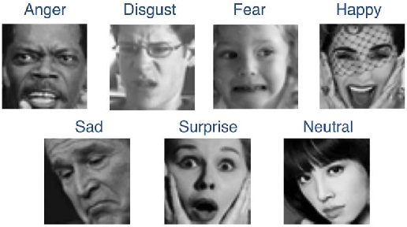

---------------------------------------------------------------------------------------------------------------------------------------------------------------------------------------------------------------------

While this is the FER2013plus labels:

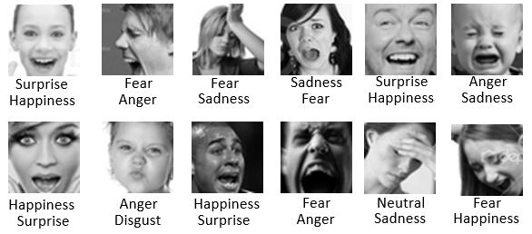

I will be using pytorch and CNN neural network models since it is best for reading images.

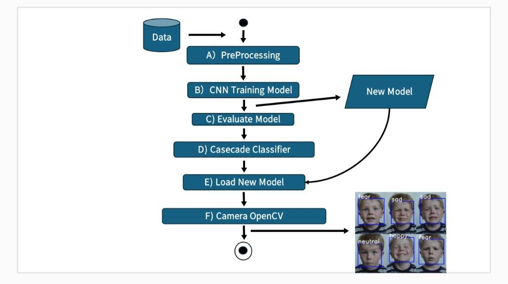

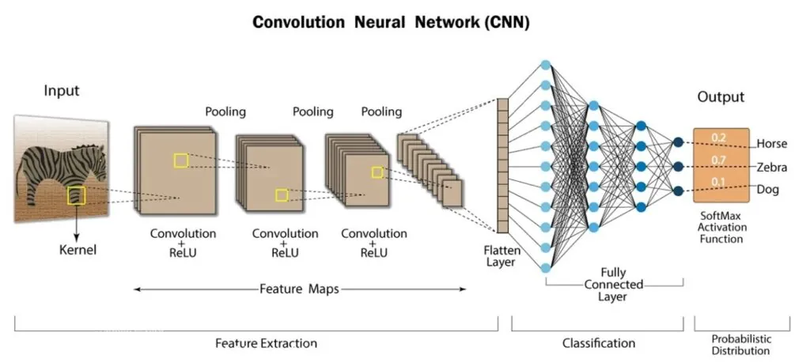

---------------------------------------------------------------------------------------------------------------------------------------------------------------------------------------------------------------------

Here are the examples of the output:

| Contempt | Neutral | Joy | Sad |
|----------|---------|-----|-----|
| 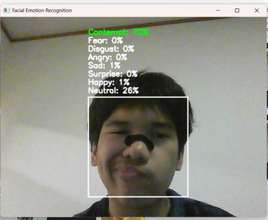 | 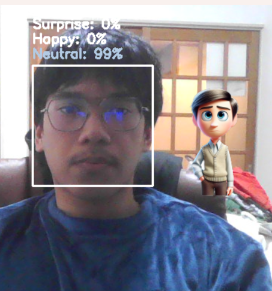 | 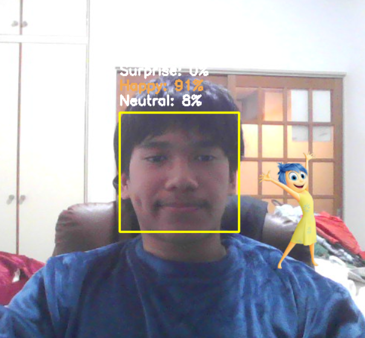 | 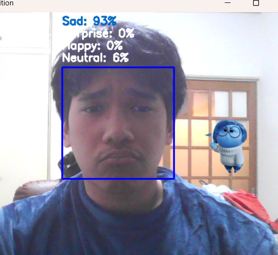 |

It also tracks multiple faces :

 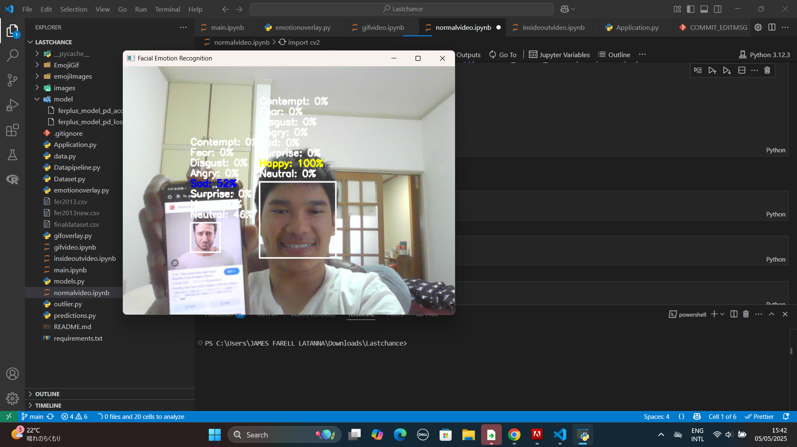 

Here are the examples of the output of the gif version:

| Video | 
|----------|
|  |

| Graph Type | Preview |
|------------|---------|
| **Total Emotion Scores** | 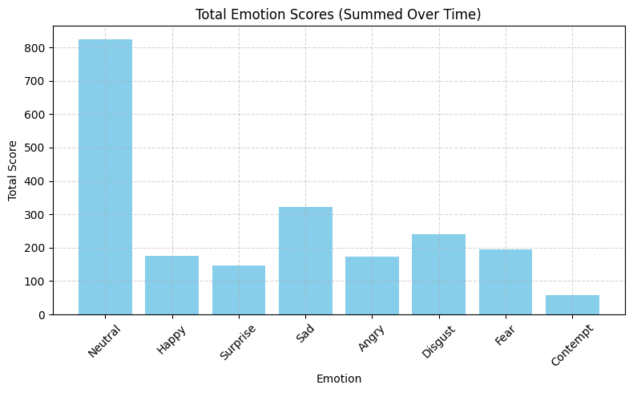 |
| **Emotion Over Time**    | 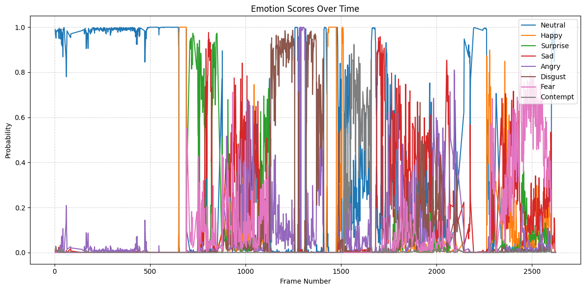   |

Not too shabby if you ask me 😂🤣😭💪  
you can find my project and use it immediately in this link:  
[Face Emotion Recognition App](https://face-emotion-recognition-ferplus-2xwcjgvcgafrku8hmsbyzm.streamlit.app/)

